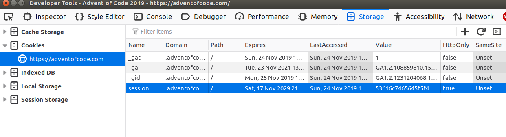

# AoC-rb

`AoC-rb` is a ruby Advent of Code command line utility. [Advent of Code](https://adventofcode.com/) is a yearly programming challenge that takes place in december.
It allows you to focus on solving the puzzles, not on the manual details:

 - it quickly downloads the puzzles
 - it bootstraps a given day, by preparing the ruby files you'll need and downloading a puzzle if necessary
 - it runs a solution for the day you are working on, loads the input file and benchmark the execution time

## How to use aoc-cli ?

Once you have installed the project, there are 2 main commands. The other one are utilities.

### aoc boostrap YEAR DAY

`aoc bootstrap` is a way to get started playing a given day.
It downloads the input file, creates a sample source file for that day, as well as a spec file. 

Here is an example that gets started playing the first day of year 2018 : `./aoc bootstrap 2018 1`
It will create the input file in the ``
```
aoc-cli
├── input
│   └── 2018
│       └── day-01
├── spec
│   ├── spec_helper.rb
│   └── year2018
│       └── day01_spec.rb
└── src
    └── year2018
        └── day01.rb
```

The `src/year/2018/day01.rb` is simple but it contains all you need: 2 methods, `part1` and `part2`, that take as parameter the content of the input file, and return the expected value.

```ruby
module Year2018
  class Day01
    # input is the content of the input file.
    # part1 should return the answer to the first part of that day 
    def part1(input)
      "expected_result"
    end

    def part2(input)
      nil
    end
  end
end
```

### aoc run YEAR DAY

If you run your solution with `aoc-run`, aoc-cli takes care of loading the input file and measuring the execution time for you.

```
./aoc run 2018 1      
Result for part 1:
expected_result
(obtained in 2.1908000235271174e-05 seconds)

no result for part 2
```

### other commands

There are 3 other commands you may want to use:

 - `aoc download YEAR DAY`: it downloads a puzzle input file in the `input` directory
 - `aoc part2 YEAR DAY`: same as `aoc run`, but only runs the part 1 for a given day
 - `aoc part2 YEAR DAY`: same as `aoc run`, but only runs the part 2 for a given day

## Installation

 - clone this project
 - install the dependencies by running `bundle install`
 - login to [adventofcode](https://adventofcode.com/), and copy your session cookie. With firefox:
   - hit F12 in order to open the developper console
   - go to «Cookie»
   - Copy the «value» field of the «session» Cookie. On the screenshot, it's the part that starts with «536…»
  
 - copy the `.env.example` file into `.env`.
 - paste the cookie in the AOC_COOKIE variable. The `.env` file should look like this:
```
AOC_COOKIE="536…"
AOC_INPUT_DIRECTORY="input"
```

You are done ! You should now be able to download the input file by running the `aoc` command.
